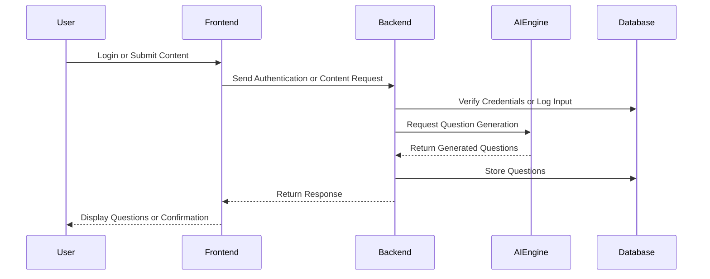

### QBaseEngine

**QBaseEngine** is a scalable, AI-enhanced web application designed to facilitate the end-to-end management of academic question banks. Developed for educational institutions, it enables administrators and educators to securely create, organize, and generate exam questions and assessments through a centralized platform.

The system not only streamlines traditional workflows for question handling but also integrates advanced Natural Language Processing (NLP) capabilities to assist in generating high-quality questions from instructional content. This ensures a consistent, efficient, and data-driven approach to exam preparation.

---

#### Core Features

- **User Authentication and Role Management**  
  Secure access for administrators and faculty members, with role-based permissions.

- **Question Bank Management**  
  Add, edit, delete, and categorize questions by subject, topic, type, and difficulty level.

- **AI-Powered Question Generation**  
  Automatically generate multiple-choice, descriptive, and true/false questions from raw text using NLP models such as T5, GPT, and BERT.

- **Question Paper Composer**  
  Assemble and export customized question papers based on filters like topic, type, and difficulty, with output formats including PDF and DOCX.

- **Advanced Search and Filtering**  
  Retrieve questions using keywords, tags, or metadata filters to improve accessibility and organization.

- **Analytics Dashboard**  
  Visualize key metrics such as question usage frequency, topic coverage, and difficulty distribution.

- **Data Security and Backup**  
  Support for periodic data backups and restoration mechanisms to ensure data integrity.

---

#### AI Capabilities

- **Automated Question Generation**  
  Extract relevant questions from paragraphs, summaries, or uploaded documents.

- **Difficulty Classification**  
  Assign complexity ratings using linguistic and semantic analysis.

- **Semantic Suggestions**  
  Provide intelligent recommendations for related or follow-up questions.

- **Text Summarization**  
  Optionally condense long-form text inputs prior to question generation to improve output precision.

---

#### Technology Stack

- **Frontend**: React.js, TypeScript, Tailwind CSS  
- **Backend**: Node.js (REST APIs), Python (for AI and NLP services)  
- **Database**: MongoDB or PostgreSQL  
- **AI/NLP Frameworks**: Hugging Face Transformers, spaCy, NLTK  
- **Additional Tools**: JWT Authentication, Docker, Redis, jsPDF

---

#### REST API Endpoints

##### Authentication

| Method | Endpoint         | Description                      |
|--------|------------------|----------------------------------|
| POST   | `/api/auth/login` | Authenticate user and issue JWT |
| POST   | `/api/auth/signup` | Register a new faculty/admin    |
| GET    | `/api/auth/profile` | Retrieve user profile info      |

##### Question Management

| Method | Endpoint                | Description                            |
|--------|-------------------------|----------------------------------------|
| GET    | `/api/questions`         | Retrieve all questions (with filters)  |
| GET    | `/api/questions/:id`     | Get details of a specific question     |
| POST   | `/api/questions`         | Add a new question                     |
| PUT    | `/api/questions/:id`     | Update an existing question            |
| DELETE | `/api/questions/:id`     | Delete a question                      |

##### AI Services

| Method | Endpoint                      | Description                                    |
|--------|-------------------------------|------------------------------------------------|
| POST   | `/api/ai/generate`            | Generate questions from provided content       |
| POST   | `/api/ai/summarize`           | Summarize text before question generation      |
| POST   | `/api/ai/classify-difficulty` | Classify question difficulty based on input    |
| GET    | `/api/ai/suggest/:questionId` | Suggest related/follow-up questions            |

##### Question Paper

| Method | Endpoint                     | Description                          |
|--------|------------------------------|--------------------------------------|
| POST   | `/api/paper/generate`        | Generate a new question paper        |
| GET    | `/api/paper/:id`             | Get question paper by ID             |
| GET    | `/api/paper/export/:id/pdf`  | Export paper as PDF                  |
| GET    | `/api/paper/export/:id/docx` | Export paper as DOCX                 |

##### Analytics

| Method | Endpoint             | Description                                |
|--------|----------------------|--------------------------------------------|
| GET    | `/api/analytics/usage` | Question usage and frequency statistics    |
| GET    | `/api/analytics/topics` | Topic coverage and distribution overview  |

##### Backup and Restore

| Method | Endpoint          | Description                    |
|--------|-------------------|--------------------------------|
| GET    | `/api/backup`      | Trigger or schedule a backup   |
| POST   | `/api/restore`     | Restore from a backup file     |

---

#### System Interaction Flow

